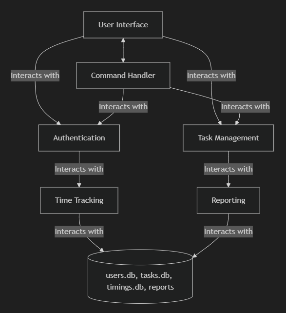

# Time Tracker Console Application

## Table of Contents

1. [Project Overview](#project-overview)

2. [App Features](#features)

    2.1 [Authenticate Users](#authenticate-users)

    2.2 [Manage Tasks](#manage-tasks)

    2.3 [Track Timing](#track-timing)

    2.4 [Tasks Report](#tasks-report)

    2.5 [Export Tasks Report](#export-tasks-report)

    2.6 [Notify Users](#notify-users)

    2.7 [CLI Tools Integration](#cli-tools-integration)

3. [Data Storage](#data-storage)

4. [User Interface](#user-interface)

5. [Mockups/Diagrams](#mockupsdiagrams)

## Project Overview

The Time Tracker Console Application is designed to help individuals track the time they spend on various personal or work-related activities through a command-line interface. The primary objectives are to enable users to manage their tasks efficiently, track time spent on each task, and gain insights into their time allocation to improve productivity.

### Scope

- The application will run in a Windows command-line environment.

- It will support user authentication, task management, time tracking, reporting, data export, notifications, and integration with other CLI tools.

### Assumptions

- Users have basic knowledge of using the command-line interface.

- The application will be used primarily for personal time management.

### Constraints

- The application will store data locally on the user's machine.

## Features

### Authenticate Users

**Description:** Users can create accounts and log in through command-line prompts. User passwords will be securely stored using hashing techniques.

**Details:**

- User account creation with email and password.
- Secure login mechanism.
- Password hashing for secure storage.

### Manage Tasks

**Description:** Users can create, edit, delete, and categorize tasks through console commands.

**Details:**

- Create new tasks with a category and task name.
- Edit existing tasks to update details.
- Delete tasks that are no longer needed.
- Filter tasks by category provided by the user.

### Track Timing

**Description:** Users can start, pause, resume and stop timers for each task, with timestamps recorded for each action. Manual adjustments to time entries are also supported.

**Details:**

- Start a timer for a task.
- Pause and resume the timer.
- Stop the timer and record the total time spent.
- Manually adjust time entries if needed.

### Tasks Report

**Description:** Users can generate and view reports of their activities in various formats, including daily, weekly, and monthly summaries.

**Details:**

- Generate text-based reports.
- Filter reports by category.
- View summaries for different time periods - Daily, weekly and monthly.
- View summaries for a user defined period - For certain number of days.

### Export Tasks Report

**Description:** Users can export their time tracking data in CSV format through command-line instructions.

**Details:**

- Export data for specific tasks or time periods.
- Generate CSV files for easy sharing and analysis.

### Notify Users

**Description:** The application will provide console-based reminders for long-running tasks and generate text alerts when predefined time limits are reached.

**Details:**

- Set reminders for tasks running longer than a specified duration.
- Receive alerts when a task exceeds its time limit.

### CLI tools Integration

**Description:** The application can integrate with other command-line tools and scripts to enhance productivity within the Windows environment.

**Details:**

- Use PowerShell scripts to automate workflows.
- Combine with other CLI tools for advanced task management.

## Data Storage

The application will use local storage for data management, ensuring offline access and backup.

**Database Schema:**

- `users.db`: Stores user IDs and hashed passwords.
- `tasks.db`: Stores task details, including category and duration.
- `category.db`: Stores the category field of tasks without duplicates.
- `timings.db`: Records start and end times for tasks.

**Data Flow:** Data will be read from and written to local databases as users interact with the application.

**Security Measures:** Passwords will be hashed, and sensitive data will be encrypted.

## User Interface

The command-line interface will provide a dashboard view for current and recent activities, along with task management and reporting tools.

- Dashboard: Display current and recent tasks.
- User Login: Prompt for user authentication.
- Task Management: Commands to view, create, edit, and delete tasks.
- Time Tracking: Commands to start, pause, resume, and stop tasks.
- Reporting: Generate and view reports sorted by category and filtered by time.

## Mockups/Diagrams

### 1. User Authentication Flow Diagram

Create a new account or login existing user.

```text
Start -> Enter Email and Password -> Validate Credentials -> Success -> Dashboard
```

If validation fails, an error message will be shown and prompt to re-enter credentials.

### 2. Task Management Interface Mockup

A simple text-based mockup of the task management commands:

|        Task Management         |
| ------------------------------ |
| 1. View Tasks                  |
| 2. Create Task                 |
| 3. Edit Task                   |
| 4. Delete Task                 |
| 5. Categorize Task             |

Enter your choice: _

### 3. Time Tracking Interface Mockup

A mockup showing how users can start, pause, and stop timers:

|        Time Tracking          |
| ----------------------------- |
| 1. Start Timer                |
| 2. Pause Timer                |
| 3. Resume Timer               |
| 4. Stop Timer                 |

Enter your choice: _

### 4. Reporting Interface Mockup

A mockup for generating and viewing reports:

|          Reports              |
|-------------------------------|
|1. Daily Report                |
|2. Weekly Report               |
|3. Monthly Report              |
|4. Filter by Task              |
|5. Filter by Category          |

Enter your choice: _

### 5. Data Flow Diagram

A diagram showing how data flows between different components:



### 6. Dashboard View Mockup

A mockup of the dashboard showing current and recent tasks:

|          Dashboard          |
|-----------------------------|
|Current Task: Task Name      |
|Elapsed Time: [HH:MM:SS]     |
|                             |
|Recent Tasks:                |
|1. Task 1 - [Duration]       |
|2. Task 2 - [Duration]       |
|3. Task 3 - [Duration]       |
